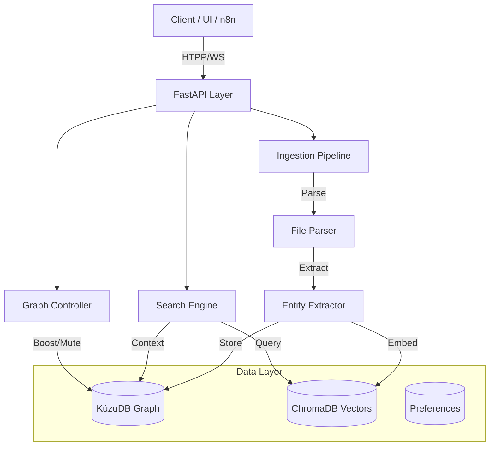

# 🧠 Mind-Q Agent

> A local-first intelligent knowledge management system that learns and adapts over time.

[](https://www.python.org/downloads/)
[]()
[](LICENSE)

---

## ✨ Features

- **📁 Smart Ingestion** — Auto-processes PDF, Markdown, and Text files.
- **🕸️ Knowledge Graph** — Semantic relationships powered by KùzuDB.
- **🔍 Hybrid Search** — Combined Vector (ChromaDB) + Graph Search.
- **⚡ Real-Time API** — WebSocket event streaming for UI/n8n.
- **🧠 Hebbian Learning** — Connections strengthen with usage.
- **📊 Analytics** — Built-in graph statistics and visualization endpoints.
- **🔗 n8n Ready** — Auto-generated OpenAPI spec for Low-Code integration.

---

## 🏗️ Architecture



---

## 🚀 Quick Start

### 1. Setup

```bash
# Clone repository
git clone https://github.com/yourusername/mind-q-agent.git
cd mind-q-agent

# Create virtual environment
python3 -m venv venv
source venv/bin/activate

# Install dependencies
pip install -r requirements.txt

# Download NLP model
python -m spacy download en_core_web_sm
```

### 2. Run the API Server

The core of Mind-Q is now exposed via a FastAPI server.

```bash
# Start server (default port 8000)
uvicorn mind_q_agent.api.app:app --host 0.0.0.0 --port 8000 --reload
```

### 3. API Documentation

Once the server is running, visit:
- **Swagger UI**: `http://localhost:8000/docs`
- **ReDoc**: `http://localhost:8000/redoc`
- **OpenAPI Spec**: `http://localhost:8000/api/v1/openapi.json`

---

## 📡 Key API Endpoints

### 📄 Documents
- `POST /api/v1/documents/upload` - Upload and ingest files (PDF, MD, TXT).
- `GET /api/v1/documents` - List all ingested documents.

### 🔍 Search
- `GET /api/v1/search?q=query` - Semantic search with ranked results.

### 📊 Graph & Analytics
- `GET /api/v1/graph/stats` - Node/Edge counts.
- `GET /api/v1/graph/analytics` - Detailed system stats (top concepts, etc.).
- `GET /api/v1/graph/visualize` - Cytoscape JSON for visualization.

### ⚡ Real-Time
- `WS /api/v1/ws/events` - Stream ingestion events (`ingestion_started`, etc.).

### ⚙️ System
- `GET /api/v1/preferences` - Get user settings.
- `GET /api/v1/system/backup` - Download full system backup (zip).
- `POST /api/v1/system/restore` - Restore system from backup.

---

## 📊 Development Phases

| Phase | Description | Status |
|-------|-------------|--------|
| **Phase 0** | Foundation (DB interfaces, config) | ✅ Complete |
| **Phase 1** | Core Ingestion & CLI | ✅ Complete |
| **Phase 2** | Learning & Graph Logic | ✅ Complete |
| **Phase 3** | Discovery Components | ✅ Complete |
| **Phase 4A** | **API Layer & System Integration** | ✅ **COMPLETE** |
| **Phase 4B** | LLM Integration | ⏳ Pending |

---

## 🔧 Tech Stack

- **Core**: Python 3.11+, FastAPI
- **Data**: KùzuDB (Graph), ChromaDB (Vector), SQLite (Prefs)
- **AI/NLP**: spaCy, sentence-transformers
- **Integration**: WebSockets, OpenAPI (n8n compatible)

---

## 📄 License

MIT License - see [LICENSE](LICENSE) for details.
