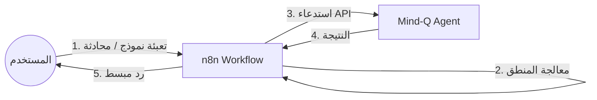

# دليل تكامل n8n مع Mind-Q للمستخدمين غير التقنيين
# n8n Integration Guide for Non-Technical Users

## 🎯 مقدمة: لماذا n8n؟
المستخدم غير التقني لا يهتم بـ APIs أو الكود. هو يريد "أتمتة" أو "أداة" تنجز العمل.
نستخدم **n8n** كـ **جسر (Bridge)** بين تعقيد Mind-Q وبين بساطة واجهة المستخدم.

### الهيكلية (The Architecture)

---

## 🛠️ كيف نخدم المستخدم غير التقني؟

بدلاً من أن نطلب من المستخدم استخدام الـ API، سنبني له **3 أنواع من الأدوات** داخل n8n:

### 1. نماذج الإدخال (n8n Forms) - "أعطني ملفك"
بدلاً من `POST /documents/upload`، ننشئ Form في n8n:
- **المستخدم يرى**: صفحة ويب بسيطة فيها حقل "رفع ملف" وزر "إرسال".
- **ما يحدث خلف الكواليس**:
    1. n8n يستلم الملف (Form Trigger).
    2. n8n يرسل الملف إلى Mind-Q API (`/documents/upload`).
    3. Mind-Q يحلل الملف ويرد بـ "تم".
    4. n8n يرسل إيميل أو رسالة Slack للمستخدم: "تمت إضافة ملفك لقاعدة المعرفة!".

### 2. بوت المحادثة (Chat Trigger) - "اسأل عقلك الثاني"
بدلاً من `GET /search`، نربط n8n بـ Telegram/WhatsApp/Slack:
- **المستخدم يكتب**: "ما هي أحدث المعلومات عن المشروع X؟"
- **ما يحدث خلف الكواليس**:
    1. n8n يستلم الرسالة (Webhook).
    2. n8n يستدعي Mind-Q Search API (`/search?q=...`).
    3. Mind-Q يرد بالنتائج الخام.
    4. n8n يستخدم LLM (مثل ChatGPT) لصياغة الرد كجملة مفيدة.
    5. n8n يرسل الرد للمستخدم على واتساب.

### 3. الأتمتة الصامتة (Background Automation)
المستخدم لا يفعل شيئاً!
- **السيناريو**: وصل إيميل مهم.
- **ما يحدث**:
    1. n8n يراقب الإيميل (Email Trigger).
    2. عند وصول إيميل من "المدير"، n8n يستخرج النص.
    3. n8n يرسله إلى Mind-Q API للحفظ.
    4. النظام يتعلم تلقائياً دون تدخل.

---

## 🔌 إعداد Mind-Q في n8n (للمطورين)

لكي يعمل هذا السحر، نحتاج لتعريف Mind-Q داخل n8n.

### الخطوة 1: استيراد ملف OpenAPI
بما أننا قمنا بتجهيز `http://localhost:8000/api/v1/openapi.json`:
1. في n8n، أنشئ **Custom Credential** (إذا لزم الأمر).
2. استخدم عقدة **HTTP Request** أو ابنِ **Custom Node** باستخدام ملف المواصفات (Spec File).
3. الآن ستظهر عمليات Mind-Q (مثل `upload`, `search`) كأوامر جاهزة في n8n وليست كـ HTTP Requests معقدة.

### الخطوة 2: بناء Workflow "البحث الذكي" (مثال)
1. **Webhook Node**: يستقبل `POST` مع `{ "question": "..." }`.
2. **Mind-Q Node (HTTP)**: يستدعي `/search` مع السؤال.
3. **OpenAI Node**:
   - System Prompt: "أنت مساعد ذكي. استخدم المعلومات التالية للإجابة على سؤال المستخدم."
   - Input: نتائج Mind-Q + سؤال المستخدم.
4. **Response Node**: يرجع الإجابة النهائية.

---

## 📝 الخلاصة
بالنسبة للمستخدم غير التقني:
- **Mind-Q** هو "العقل" المخفي.
- **n8n** هو "الواجهة" أو "السكرتير" الذي يتحدث معه.
- **الـ API** هو اللغة التي يتفاهم بها العقل والسكرتير.

نحن لا نعطي المستخدم مفاتيح السيارة (API)، بل نخصص له سائقاً (n8n) ليوصله وجهته.
